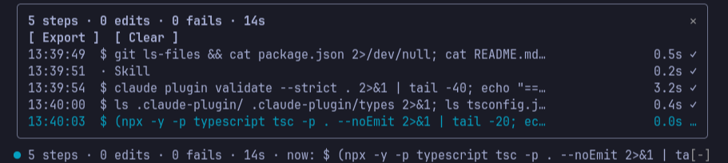

# Stepscope — flight recorder for Claude Code

See what Claude is doing while it works. Stepscope records every tool call in
the current session and shows it live: a one-line band above the prompt with
step, edit and failure counts plus the step running now, and a timeline pane
you open with `/fr`. It warns you when Claude looks stuck or edits files
outside your project, and exports a clean Markdown log you can read before
you commit or paste into a pull request.



## Requirements

- Claude Code v2.1.287 or later (mods). Tested with 2.1.287.
- Draws in the terminal and the Desktop app's Code tab. In the VS Code chat
  panel and `claude -p`, `/fr` prints a text summary instead.

## Commands

| Command | What it does |
| --- | --- |
| `/fr` | Open or close the timeline pane |
| `/fr export [path]` | Write the session log as Markdown (default `flight-recorder-YYYYMMDD-HHMM.md` in the project root). Never overwrites a file. |
| `/fr clear` | Start the timeline over |

## Alerts

- **Stuck loop:** the same shell command fails 3 times in a row.
- **Edit outside the project:** Claude edits a file outside the session's project root.
- **Long step:** the band turns amber when a step runs longer than 60 seconds.

## Settings

Set with `/plugin configure stepscope@<marketplace>`:

| Option | Default | Meaning |
| --- | --- | --- |
| `failStreak` | 3 | Failures in a row before the stuck-loop alert |
| `longStepSeconds` | 60 | Seconds before a running step turns the band amber |
| `showBand` | true | Show the band above the prompt |

## What it reads and writes

- Reads each tool call's name, arguments and result inside Claude Code, in
  memory, for the current session only. Nothing is saved between sessions.
- Never changes, blocks or approves a tool call.
- No network access, no processes, no model calls.
- Writes a file only when you run `/fr export` or press **Export**, at the
  path shown in the reply.

## Development

```bash
claude plugin test              # unit and hook tests
claude plugin validate --strict .
claude --plugin-dir .           # try it live; edits hot-reload
```

## License

MIT
